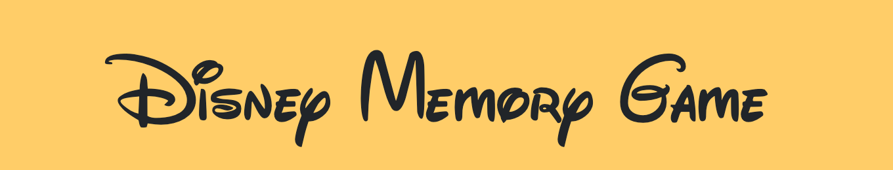

Link to App: **https://vibrant-kilby-de2b43.netlify.com**

---

## Overview:
#### A Disney memory game created with React
1. Created a new React application using [Create React App](https://github.com/facebook/create-react-app).

2. The application renders different images to the screen. Each image listens for click events.

3. The application keeps track of the user's score. The user's score is incremented when an image is clicked for the first time. The user's score resets to 0 if they click the same image more than once.

4. Every time an image is clicked, the images rendered to the page shuffle in a random order.

5. After an incorrect guess, the game restarts and the user's score is set to zero and their high score is saved.

---

## Tools + Languages Used:
* ReactJS - https://reactjs.org/
* JavaScript - programming language https://developer.mozilla.org/en-US/docs/Web/JavaScript
* Bootstrap - web styling framework https://getbootstrap.com/docs/4.4/getting-started/introduction/
* Custom CSS - styling
* Unsplash - background image https://unsplash.com/
* All movie cover images found on google
---

## Features:

